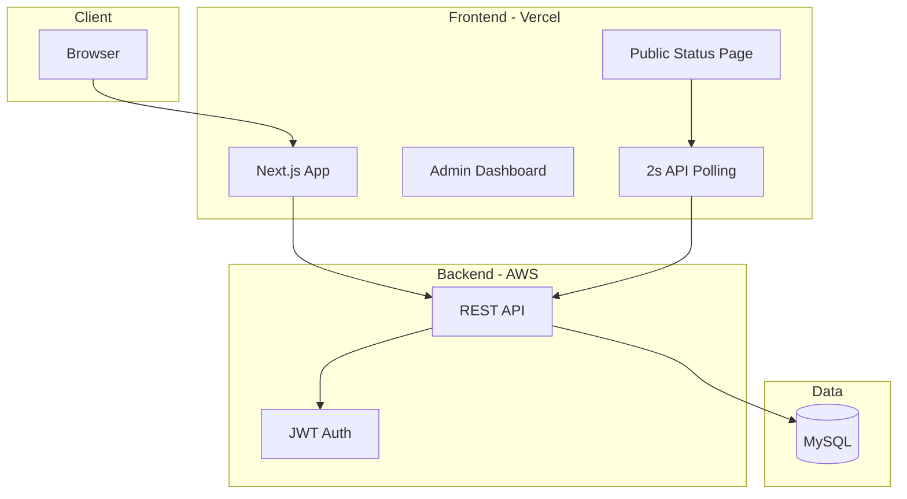

# Status Page Application – Full-Stack Plan (Revised)

## Architecture Overview



- **Two repositories**: `clearstatus-frontend` and `clearstatus-backend`, deployed independently.
- **Auth**: **Sign in with Google only.** Single flow: user clicks "Sign in with Google"; backend verifies Google ID token, finds user by email or **creates account if it doesn't exist**, then issues app JWT. No separate signup/signin APIs.
- **Public APIs**: Status page data (services, incidents, timeline) — no auth.
- **Real-time**: No WebSockets. Frontend uses **API polling every 2 seconds**; UI re-renders **only when the polled response actually changes** (compare previous vs new response, update state only if different).

---

## 1. Backend (Go) – Separate Repo

**Suggested stack**: Chi or Echo (router), `database/sql` + sqlx or GORM, `golang-jwt/jwt`, MySQL 8. **No WebSocket server.**

### 1.1 Project Structure

```
clearstatus-backend/
├── cmd/server/main.go
├── internal/
│   ├── config/
│   ├── auth/          # JWT issue/validate, Google ID token verification
│   ├── middleware/    # Auth, CORS, request ID
│   ├── handler/       # HTTP handlers (auth, org, team, service, incident, public)
│   ├── model/         # Domain structs
│   ├── store/         # DB access (per entity)
│   └── validator/
├── migrations/        # SQL migrations (e.g. golang-migrate)
├── deploy.md
├── Dockerfile
├── go.mod
└── README.md
```

### 1.2 Database Schema (MySQL)

- **users**: id, email, name, avatar_url, google_id (nullable, unique), created_at, updated_at. No password — Google-only auth; account is created on first sign-in if not exists.
- **organizations**: id, name, slug (unique), created_at, updated_at.
- **organization_members**: org_id, user_id, role (owner/admin/member), created_at.
- **teams**: id, org_id, name, created_at, updated_at.
- **team_members**: team_id, user_id, role, created_at.
- **services**: id, org_id, name, slug, description, status (enum: operational, degraded, partial_outage, major_outage), sort_order, **version** (INT, default 1), created_at, updated_at. **Optimistic locking**: every update uses `WHERE id = ? AND version = ?` and increments `version`; if affected rows = 0, return 409 Conflict.
- **incidents**: id, org_id, title, status (investigating, identified, monitoring, resolved), type (incident/maintenance), **version** (INT, default 1), created_at, updated_at, resolved_at. **Optimistic locking**: same as services — update with `WHERE id = ? AND version = ?`, increment version; 409 on conflict.
- **incident_services**: incident_id, service_id (many-to-many).
- **incident_updates**: id, incident_id, message, status, created_at.
- **status_history** (optional): service_id, status, created_at — for timeline and audit.

Indexes: org_id/slug on services and orgs, (org_id, user_id) on members, incident_id on updates. Use InnoDB and explicit transactions where multiple tables are updated.

### 1.3 Concurrency and Race Conditions

- **Optimistic locking with version**: `services` and `incidents` each have a `version` column (INT, default 1). On every update: `UPDATE ... SET ..., version = version + 1 WHERE id = ? AND version = ?`; if `RowsAffected() == 0`, return **409 Conflict** and let client refetch and retry. All update responses include the new `version` so the client can send it on the next update.
- **Transactions**: Use `BEGIN`/`COMMIT`/`ROLLBACK` for operations that touch multiple tables (e.g. create incident + link services + first update).
- **Connection pool**: Limit MySQL max open connections; use a single `*sql.DB` and avoid holding connections across heavy work.

### 1.4 API Design

| Area | Method | Path | Auth | Description |
|------|--------|------|------|-------------|
| Auth | POST | /api/auth/google | No | Body: `{ "id_token": "..." }`. Verify Google ID token, find or create user by email, return JWT. Single entry point — no separate signup/signin. |
| Orgs | CRUD | /api/orgs, /api/orgs/:id | JWT | Org management |
| Orgs | GET/POST | /api/orgs/:id/members | JWT | Members |
| Teams | CRUD | /api/orgs/:id/teams, ... | JWT | Teams under org |
| Services | CRUD | /api/orgs/:id/services | JWT | Services + status |
| Incidents | CRUD | /api/orgs/:id/incidents | JWT | Incidents + updates |
| **Public** | **GET** | **/api/public/orgs/:slug/status** | **No** | **Full status + incidents + timeline (for polling)** |

Public route: `/api/public/orgs/:slug/status` returns a stable JSON structure (services, current incidents, recent timeline). Frontend will poll this every 2 seconds and update UI only when the response body changes.

### 1.5 Auth (Google + JWT)

- **Single endpoint**: `POST /api/auth/google` with body `{ "id_token": "<Google ID token>" }`. Frontend uses Google Identity Services (or OAuth 2.0) to get the ID token after user signs in with Google; send that token to the backend.
- **Backend**: Verify the ID token with Google (e.g. Google's tokeninfo endpoint or verify signature with Google's JWKS). Extract email (and optionally name, picture). Look up user by `email`; if not found, **create user** (email, name, avatar_url, google_id) and then issue app JWT. If found, issue JWT. Return `{ "token": "<JWT>", "user": { ... } }`.
- **Middleware**: For protected routes, parse `Authorization: Bearer <token>`, validate JWT signature and expiry, attach user to context.
- **CORS**: Allow frontend origin (e.g. Vercel domain).

---

## 2. Frontend – Separate Repo

**Stack**: Next.js 14+ (App Router), ShadcnUI, Tailwind, Linear-like minimal UI (clean typography, subtle borders, soft backgrounds).

### 2.1 Project Structure

```
clearstatus-frontend/
├── app/
│   ├── (auth)/login/page.tsx   # Single page: "Sign in with Google" only
│   ├── (dashboard)/org/[orgSlug]/...   # Teams, services, incidents
│   ├── (public)/status/[orgSlug]/page.tsx   # Public status page
│   ├── layout.tsx
│   └── page.tsx                        # Landing or redirect
├── components/
│   ├── ui/           # ShadcnUI
│   ├── layout/       # Sidebar, header
│   ├── services/     # Service list, status badge, form
│   ├── incidents/    # Incident list, updates, form
│   └── public/       # Public status components
├── lib/
│   ├── api.ts        # Fetch wrapper (base URL, attach JWT)
│   ├── auth.ts       # Token storage, login/logout
│   ├── polling.ts    # useStatusPolling hook (2s, change-only updates)
│   └── types.ts      # DTOs matching backend
├── deploy.md
└── package.json
```

### 2.2 API Polling (2s, Update Only on Change)

- **Polling interval**: 2 seconds for the public status endpoint (and optionally for dashboard views that show live status).
- **Endpoint**: `GET /api/public/orgs/:slug/status` (no auth).
- **Change detection**: Before updating React state, compare the new response with the previous one. Options:
  - **Deep equality**: Use a fast deep-equal (e.g. `lodash/isEqual` or a small `fast-deep-equal`) on the parsed JSON; update state only if `!isEqual(prev, next)`.
  - **Stable hash**: Backend can optionally return an `ETag` or `Last-Modified` (or a custom `X-Status-Hash` header) derived from current services + incidents; frontend sends `If-None-Match` or `If-Modified-Since` and only parses body / updates state when backend returns 200 with new body (or 304 with no body and no state update).
- **Implementation**: Custom hook `useStatusPolling(orgSlug)` that:
  - Uses `setInterval` (or `setTimeout` in a loop) with 2000 ms.
  - Fetches `/api/public/orgs/${orgSlug}/status`.
  - Keeps previous result in a ref; compares new result with previous (deep compare or hash); calls `setState` only when different.
  - Cleans up interval on unmount.
- **Result**: No re-render on every poll — only when the API response actually changes, keeping the UI simple and efficient.

### 2.3 UI Direction (Linear-like + ShadcnUI)

- **Theme**: Light default; optional dark mode. Neutral grays, one accent (e.g. blue or violet). Use ShadcnUI components (Button, Card, Input, Table, Dialog, Select, Badge).
- **Layout**: Sidebar with org switcher, nav (Services, Incidents, Teams, Settings). Top bar: user menu, current org.
- **Public page**: Single column: org name, “All Systems Operational” or summary, then list of services with status badges, then active incidents/maintenances, then timeline (grouped by date). This page uses `useStatusPolling(orgSlug)` so it updates every 2s only when data changes.

### 2.4 Auth Flow

- **Sign in with Google only**: Single login page with one button: "Sign in with Google". Use Google Identity Services (e.g. `@react-oauth/google`) to get the Google ID token; send it to `POST /api/auth/google`. Backend creates account if user doesn't exist and returns JWT. Store JWT (e.g. in memory + localStorage). Redirect to dashboard or org default.
- **API client**: For every request to backend (except public and auth), add `Authorization: Bearer <token>`. On 401, clear token and redirect to login.
- **Protected layout**: Check token; if missing, redirect to login.

---

## 3. Deployment

### 3.1 Frontend – Vercel (`deploy.md` in frontend repo)

- **Build**: Next.js; set root directory if monorepo.
- **Env**: `NEXT_PUBLIC_API_URL` (backend API base URL).
- **Security**: No secrets that must stay server-only in `NEXT_PUBLIC_*`; keep JWT client-side only. Use Vercel’s env UI (production/preview).
- **Steps**: Connect repo → add env vars → deploy. Optional: preview URLs for branches.

### 3.2 Backend – AWS (`deploy.md` in backend repo)

- **Options**: ECS (Fargate) + ALB, or single EC2, or App Runner. Recommend **ECS Fargate + ALB** for HTTPS and scaling.
- **Database**: RDS MySQL 8 in private subnet; security group allows backend only. No public DB.
- **Secrets**: JWT signing key and DB URL in AWS Secrets Manager or Parameter Store; inject into container env.
- **SSL**: ALB with ACM certificate; redirect HTTP → HTTPS. Frontend calls `https://api.yourdomain.com`.
- **CORS**: Allow `https://<vercel-project>.vercel.app` and production domain.
- **Security**: VPC, private subnets for app and DB; minimal IAM roles; no JWT secret in code or logs.

---

## 4. Deliverables Checklist

| Item | Location |
|------|----------|
| Backend repo | Go app, migrations, Dockerfile, `deploy.md` (AWS); **no WebSocket** |
| Frontend repo | Next.js + ShadcnUI, auth, dashboard, public page, **polling hook**, `deploy.md` (Vercel) |
| Auth | Sign in with Google only (find-or-create user), single POST /api/auth/google, JWT, protected routes |
| Orgs & teams | Multi-tenant orgs, team CRUD and members |
| Services | CRUD, status enum, **version-based optimistic locking** |
| Incidents | CRUD, link to services, updates, **version-based optimistic locking** |
| **Real-time** | **API polling every 2s; UI updates only when response changes** |
| Public page | GET public API, public status page using polling |
| Concurrency | Transactions, **version column** on services and incidents for optimistic locking (409 on conflict) |
| Docs | `deploy.md` in each repo for Vercel and AWS |

---

## 5. Suggested Implementation Order

1. **Backend**: Config, DB migrations, auth (single `POST /api/auth/google` — verify Google ID token, find-or-create user, JWT), JWT middleware, org CRUD, then services and incidents with **version-based optimistic locking**, then public GET `/api/public/orgs/:slug/status`.
2. **Frontend**: Next.js + ShadcnUI setup, single login page ("Sign in with Google" only, e.g. `@react-oauth/google`), API client with JWT, dashboard layout, org/team/service/incident screens (send `version` on updates for optimistic locking), then public status page with `useStatusPolling(orgSlug)` and deep-equality so UI updates only when the polled response changes.
3. **Deploy**: Write both `deploy.md` files; deploy backend (RDS + ECS), then frontend (Vercel); test end-to-end and CORS.

This keeps the two repos independent, uses **Sign in with Google only** (one auth API, find-or-create user), **version-based optimistic locking** on services and incidents, JWT for all non-public APIs, and 2s polling with change-only UI updates for a minimal real-time experience.
